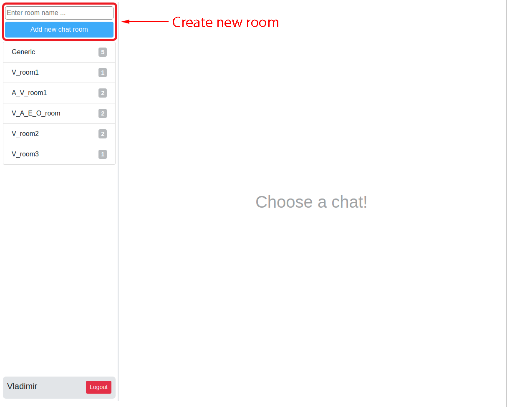
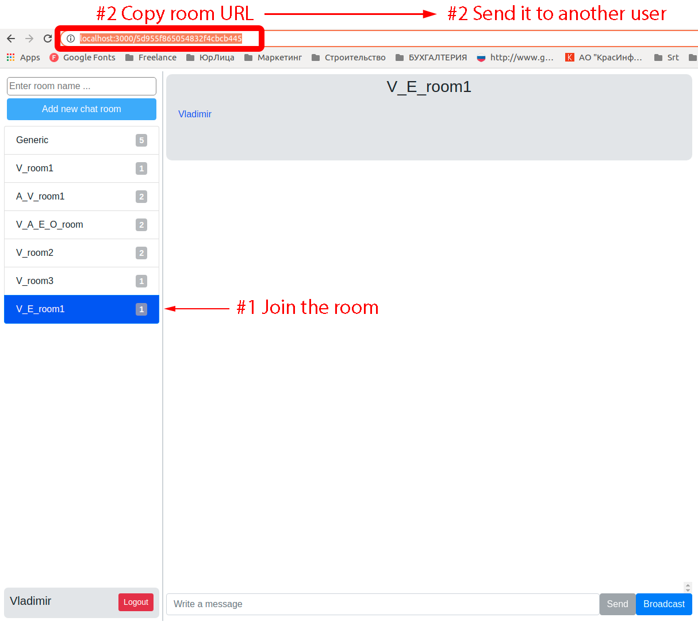
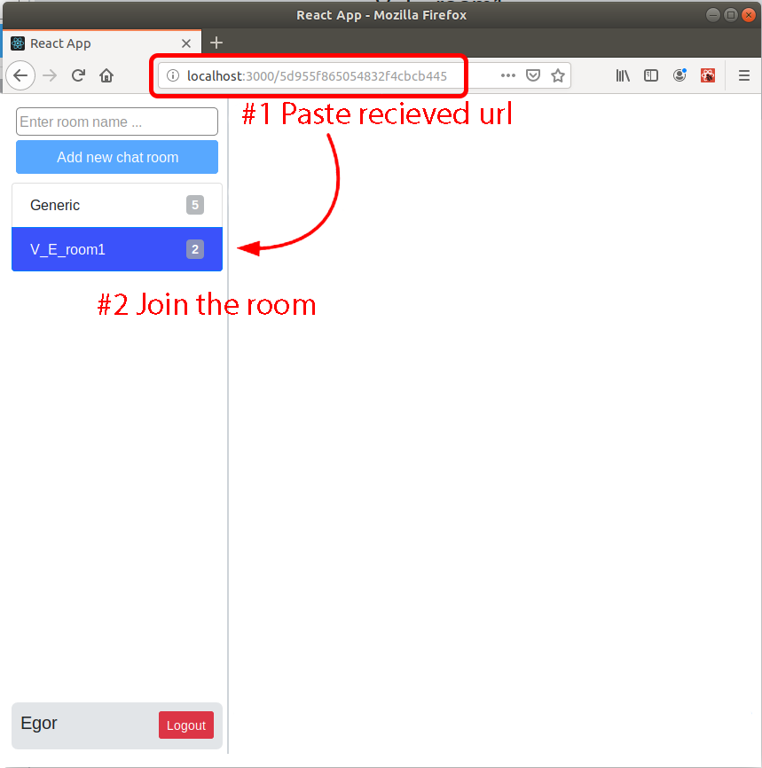
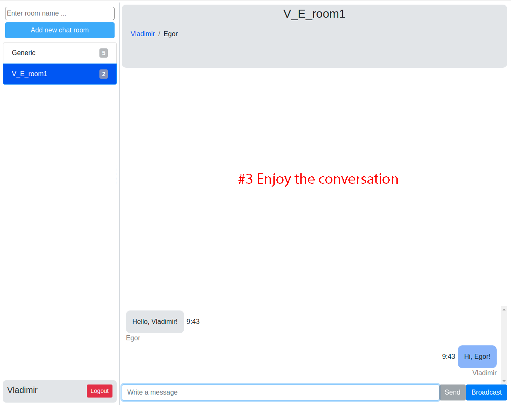
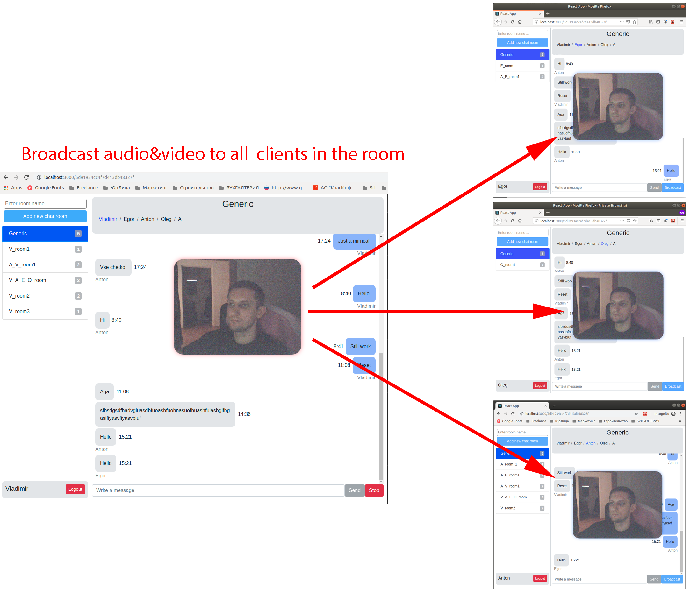

# T&V messenger
  t&v-messenger is a chat rooms messaging app for text communication with possibility to broadcast video and audio from your devices to other participants of the room.
# Features
User can:
* create new chat rooms
* send text messages to the chat room
* have multiple chat rooms per user
* invite new users to the room
* broadcast video & audio from local devices to all participants of the chat room
### Welcome screen
On welcome page you need to log in. Just
enter your nickname and you ready to go.

  

### Main Page
Here you can:
* create a new chat room
* enter any room in the list
* logs out

  

### The Rooms
When you inside of the room you can:
* send text messages to all participants of the room
* invite new users to the room
* broadcast video & audio from local devices to all participants of the room

**Invite new client to a chat room:**
You can invite new users to a chat room. Just copy URL to the room and send to another user to invite him

  
  
  

**broadcasting:**
You can start video streaming from webcamera, so other participants of the chat room will recieve video and audio from your devises.

  

### Tech Stack & Technologies
* Node.js
* MongoDB
* React
* Reactstrap
* WebRTC
* WebSockets (Socket.io)